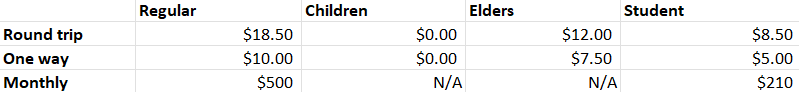
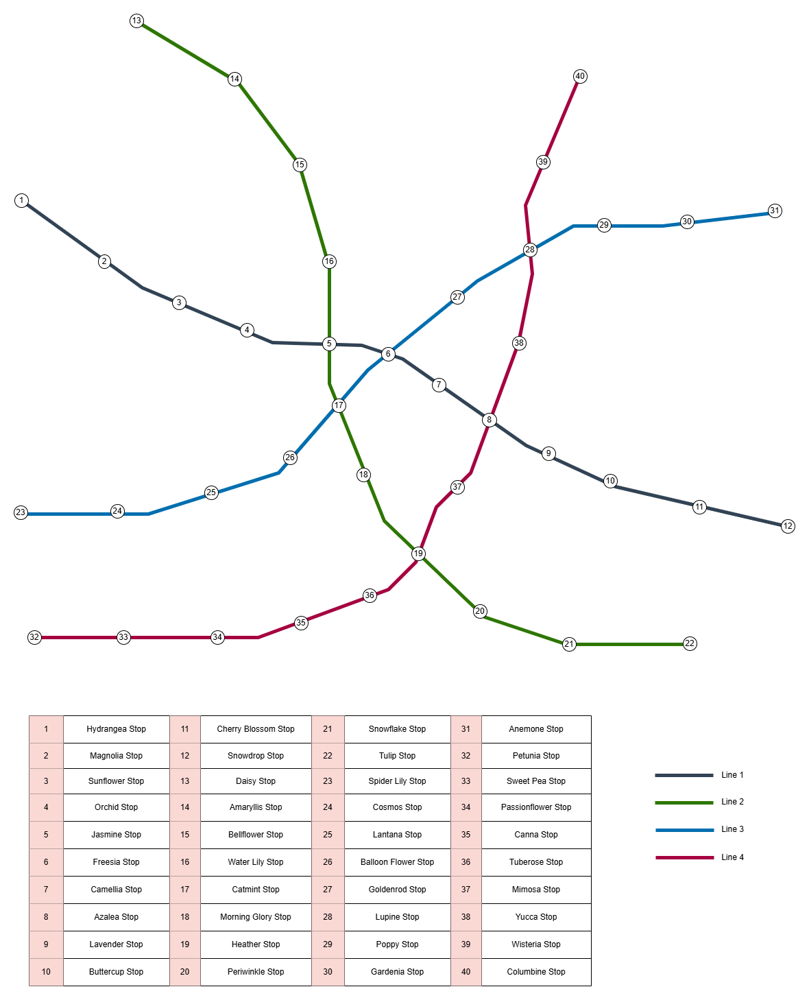
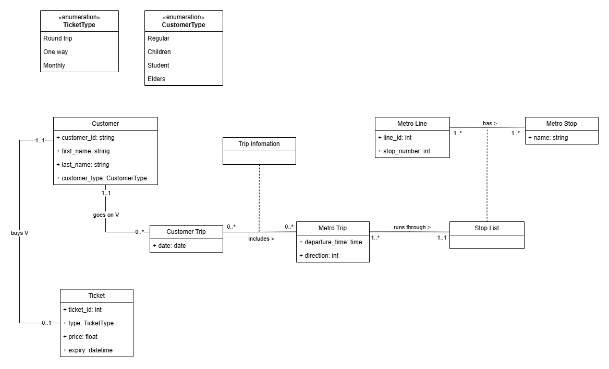
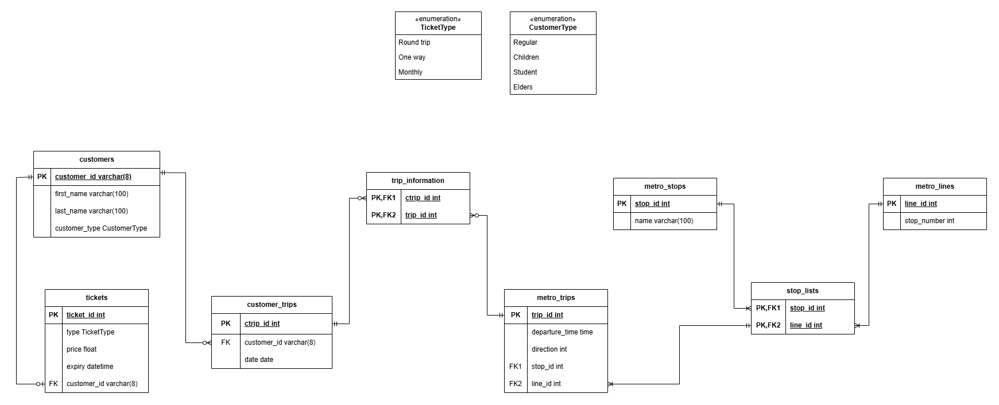

# THE METRO PROJECT

In progress.

*Description:*

A metro system includes many metro lines, and each line will have multiple stops. To ride the metro, a customer must buy a ticket, and one customer can only have one ticket. There are different types of customers, including "regular", "children", "elders", and "student", and these types will have different benefits on ticket prices. Children are people who are fewer than 6 years old, and elders are people who are 65+ years old. 

There are, of course, different types of tickets: "round trip", "one way", "monthly", and these ticket types will have different prices. 
The ticket prices will be as follow: 

One line will have multiple trips on a day, and each trip in one line will have different departure time (if running in the same direction). For example, line A can have many trips departing at 1:50pm, 2:00pm, 2:10pm,... Different lines can have trips with the same departure time (e.g., Line A and B can have trips running at 2:30pm). 

Each line will run in two directions, and there can be two trips in one line, with the same time but running in opposite directions. For example, Line B can have two train trips running at 3:00pm if these trips run in the opposite directions (from M to P and from P to M). 

A metro line, of course, has multiple stops, and to make it easy, I'll assume the departure time of each stop is 5 minutes apart. Each trip (with same direction in the same line) will be 10 minutes apart. 

I'd drawn a metro map from my imagination, with the stop names inspired by flowers! Of course, these stop names or metro lines are all fake, if they somehow appear in some real cities somewhere on Earth (which is very unlikely), it is just a coincidence.

### Step 1: Which classes do we need for a metro system?
- Metro lines
- Metro trips
- Metro stops
- Customers
- Tickets
- Customer types: students, elderly people, children, regular. 
- Ticket types: round trip (runs in 24 hours), one way, monthly

### Step 2: Create a UML diagram

I'm not sure if I drew the diagram correctly but here it is...

### Step 3: Create a ER diagram

### Step 4: Create the database in PostgreSQL! 
