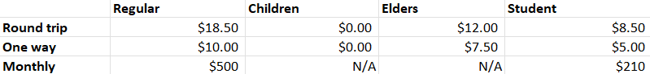

# THE METRO PROJECT

In progress.

Description: 
A metro system includes many metro lines, and each line will have multiple stops. To ride the metro, a customer must buy a ticket, and one customer can only have one ticket. There are different types of customers, including "regular", "children", "elders", and "student", and these types will have different benefits on ticket prices. There are, of course, different types of tickets: "round trip", "one way", "monthly", and these ticket types will have different prices. 
The ticket prices will be as follow: 
One line will have multiple trips on a day, and each trip in one line will have different departure and arrival times. Different lines can have trips with the same departure or arrival time.  

Step 1: Which classes do we need for a metro system?
- Metro lines
- Metro trips
- Metro stops
- Customers
- Tickets
- Customer types: students, elderly people, children, regular. 
- Ticket types: round trip (runs in 24 hours), one way, monthly
